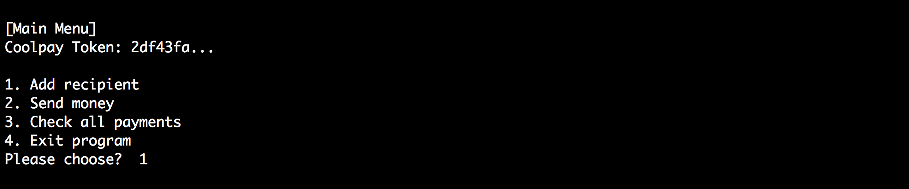
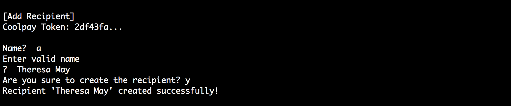
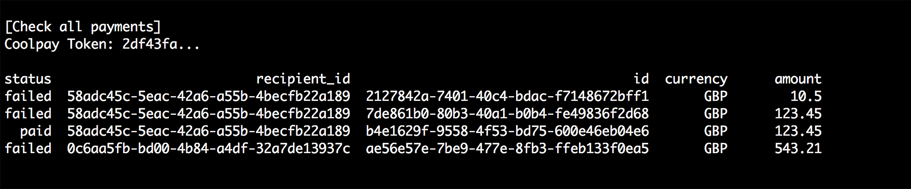

# Fakebook - Ruby console program which supports Coolpay API

## Introduction

Coolpay is a new company that allows to easily send money to friends through their API.

You work for Fakebook, a successful social network. You’ve been tasked to integrate Coolpay inside Fakebook. A/B tests show that users prefer to receive money than pokes!

You can find Coolpay documentation here: http://docs.coolpayapi.apiary.io/

This is a small app that uses Coolplay API in Ruby. The app is able to do the following:

1. Authenticate to Coolpay API

2. Add recipients

3. Send them money

4. Check whether a payment was successful

## Installation

### Bundle
```console
   bundle install
```

### Environment variables for Coolpay API

You need to set the following environment variables before launching the app.

```console
  export COOLPAY_USERNAME=<SzymonM>
  export COOLPAY_APIKEY=<your_private_api_key>
```

## Running

```console
   >bin/fakebook
```

## Automatic tests

### Rspec
```console
   bundle exec rspec
```   

## Screenshots

**Main menu**



**Create Recipient**



**Send money first step. Find recipient.**


**Send money with success**


**Check all payments**



**Send money with validation error**


[November 2018]
